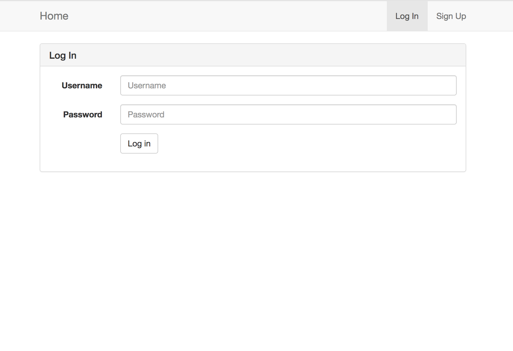

# rest-api-development - WLKB :boom:

CS5331 Assignment 1 Project Reference Repository

## Instructions

Your objective is to implement a web application that provides the endpoints
specified here: https://cs5331-assignments.github.io/rest-api-development/.

The project has been packaged in an easy to set-up docker container with the
skeleton code implemented in Python Flask. You are not restricted in terms of
which language, web stack, or database you desire to use. However, please note
that very limited support can be given to those who decide to veer off the
beaten path.

You may be required to modify the following files/directories:

* Dockerfile - contains the environment setup scripts to ensure a homogenous
  development environment
* src/ - contains the front-end code in `html` and the skeleton Flask API code
  in `service`
* img/ - contains images used for this README

Assuming you're developing on an Ubuntu 16.04 machine, the quick instructions
to get up and running are:

```
# Install Docker

sudo apt-get update
sudo apt-get install \
    apt-transport-https \
    ca-certificates \
    curl \
    software-properties-common
curl -fsSL https://download.docker.com/linux/ubuntu/gpg | sudo apt-key add -
sudo add-apt-repository \
   "deb [arch=amd64] https://download.docker.com/linux/ubuntu \
   $(lsb_release -cs) \
   stable"
sudo apt-get update
sudo apt-get install docker-ce

# Verify Docker Works

sudo docker run hello-world

# Run the skeleton implementation

sudo ./run.sh
```

```
# Install Docker Compose

# Run this command to download the latest version of Docker Compose

sudo curl -L https://github.com/docker/compose/releases/download/1.19.0/docker-compose-`uname -s`-`uname -m` -o /usr/local/bin/docker-compose

# Apply executable permissions to the binary

sudo chmod +x /usr/local/bin/docker-compose

# Test the installation

docker-compose --version
```

(Docker CE installation instructions are from this
[link](https://docs.docker.com/install/linux/docker-ce/ubuntu/#install-using-the-repository).)

**Please consult your assignment hand-out for detailed setup information.**

## Grading

The implementation will be graded in an automated fashion on an Ubuntu 16.04
virtual machine by building the docker container found in your repository and
running it. The grading script will interact with your API.

The following ports are expected to be accessible:

1.  80, on which static HTML content, including the front-end, is served.
2.  8080, on which the API is exposed.

To verify this, please run the following commands:

```
sudo ./run.sh
```

On a different window:

```
curl http://localhost:80
curl http://localhost:8080
```

If a response is received, you're good to go.

**Please replace the details below with information relevant to your team.**

## Screenshots :facepunch:

* Register a User
  

* Log In
  

* Log Out
  

* Display All Public Diaries
  

* Display All Authenticated User's Diaries
  

* Create a New Diary
  

* Delete an Existing Diary
  

* Toggle a Diary's Permission
  

* User Profile
  

## Administration and Evaluation

Please fill out this section with details relevant to your team.

### Team Members

1.  Wei Ran (A0174375X)
2.  Liu Chao (A0174462A)
3.  Kong Chao (A0174435A)
4.  Bai Xin (A0163129H)

### Short Answer Questions :pray:

#### Question 1: Briefly describe the web technology stack used in your implementation.

Answer:

* frontend: react
* backend with api: flask
* database: sqlite

#### Question 2: Are there any security considerations your team thought about?

Answer:

* user input sanitization both in frontend and backend to prevent XSS attack
* implement ORM on top of database layer to prevent SQL injection
* add secure cookie in reponse header to prevent XSRF attack
* implement HTTPs for secure request and apply for SSL Certificate for the server

#### Question 3: Are there any improvements you would make to the API specification to improve the security of the web application?

Answer:

* Server side should expire token in a short period to prevent token leakage danger
* Backend can record the request's ip address and check for abnormal request from different locations.
* Server side should expire user's token when observing massive requests in a short period of time.

#### Question 4: Are there any additional features you would like to highlight?

Answer:

* Reponsive and modern UI

#### Question 5: Is your web application vulnerable? If yes, how and why? If not, what measures did you take to secure it?

Answer: To some extend can be considered as secure

* Both frontend and backend sanitize user input before processing the request
* Server side implments ORM on top of the database to prevent SQL injection.

#### Feedback: Is there any other feedback you would like to give?

Answer: No, the API docs looks good.

### Declaration :confetti_ball: :tada: :bell:

1.  Wei Ran
    * Test the API robustness with edge cases
    * Test the web security with the possible XSS attack
2.  Liu Chao
    * Write the front-end code and test the API functionality
    * Refine the docker build process
3.  Kong Chao
    * Test the API robustness with edge cases
    * Test the web security with the possible SQL injection attack
4.  Bai Xin
    * Design the database schema
    * Implement the rest API functions
